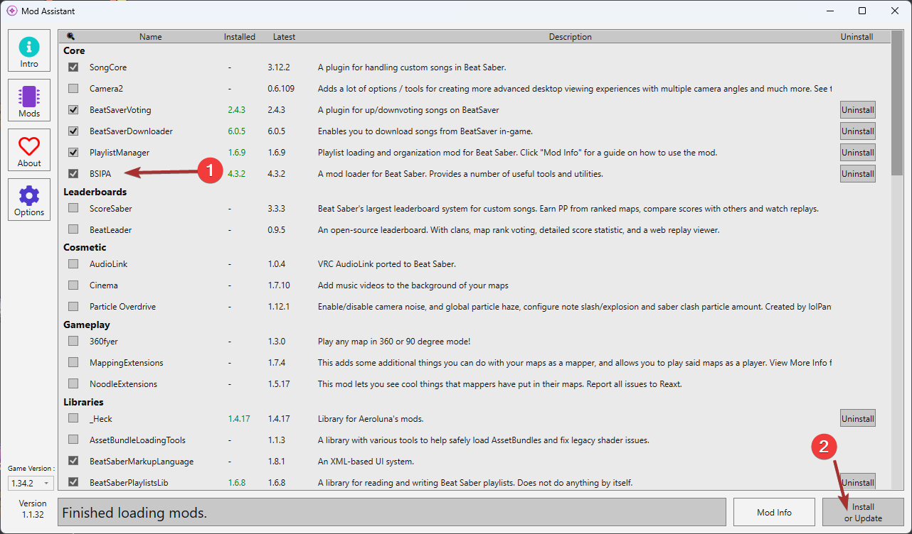
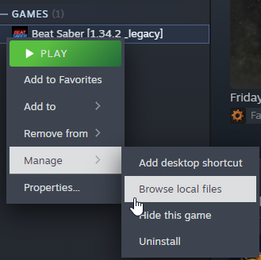
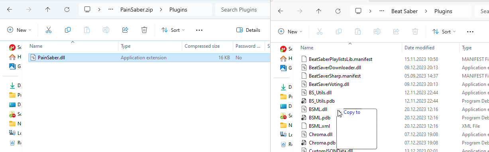
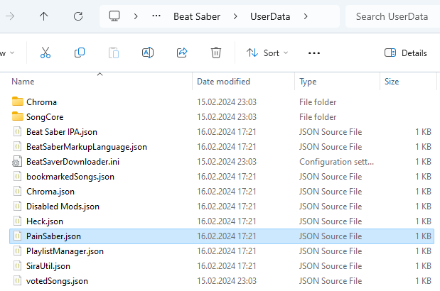

# Installation

## 0. Open beatsaber

Before installing BSIPA you need to open Beatsaber at least once.

## 1. Install dependencies

Install the newest BSIPA version.

You may use this modding tool:
https://github.com/Assistant/ModAssistant



## 2. Open beatsaber again

In order for BSPIA to initialize, open BeatSaber once again.


## 3. Download this mod

Download the newest version: 
https://github.com/miterosan/PainSaber/releases/

## 4. Put PainSaber.dll into your plugins folder

Open the beatsaber directory.



Move the /plugins/PainSaber.dll from the zip into the plugin directory from beatsaber 



## 5. Start Beatsaber again

In order to generate the config file for PainSaber you need to open the game again. After the game loaded you may close it again.

## 6. Configure PainSaber

Open the PainSaber.json in the UserData directory of Beatsaber.



Create a new API key at shocklink and paste it into the "OpenShockApiKey" value.

https://shocklink.net/#/dashboard/tokens

Insert the id of the control box into "Device".
The id can be found at the device overview. (click on the three dots and then on edit)

https://shocklink.net/#/dashboard/devices

Adjust the duration and strength of NoteMissed/-Failed/BombCut/HeadInWall to your liking.

DurationMs and IncrementEveryMs are in milliseconds. (1000 milliseconds is one second)

Put the **names** (not ID) of the shockers you want to use into each Shockers list.

## Example Config

```json
{
    "OpenShockApiKey": "LaOQcombMYuRwvcnUp8zFnPW0Z2Oowu56SIRK9L4hU02vlPESt3uv8gVgIykvIsF",
    "Device": "e15df0d6-6d29-3151-b42a-b6255d3356a5",
    "NoteMissed": {
        "Shockers": [
            "Left Leg",
            "Right Leg"
        ],
        "Intensity": 50,
        "DurationMs": 400
    },
    "NoteFailed": {
        "Shockers": [
            "Left Leg",
            "Right Leg",
        ],
        "Intensity": 70,
        "DurationMs": 400
    },
    "BombCut": {
        "Shockers": [
            "Right Arm",
            "Left Arm",
            "Left Leg",
            "Right Leg",
        ],
        "Intensity": 80,
        "DurationMs": 1000
    },
    "HeadInWall": {
        "Shockers": [
            "Right Arm",
            "Left Arm",
        ],
        "StartIntensity": 50,
        "IncrementBy": 10,
        "IncrementEveryMs": 200
    }
}
```